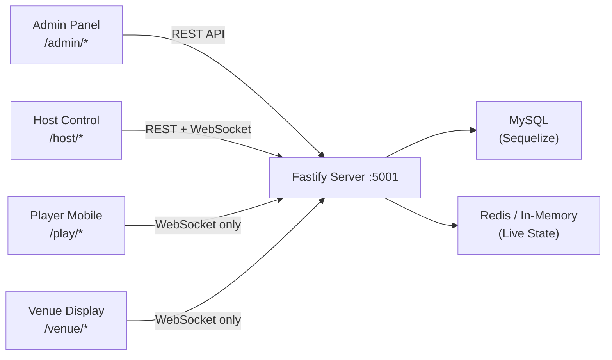
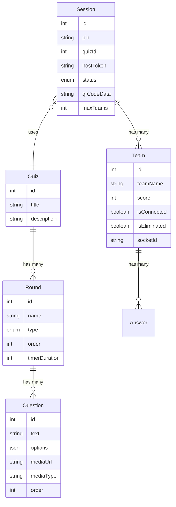
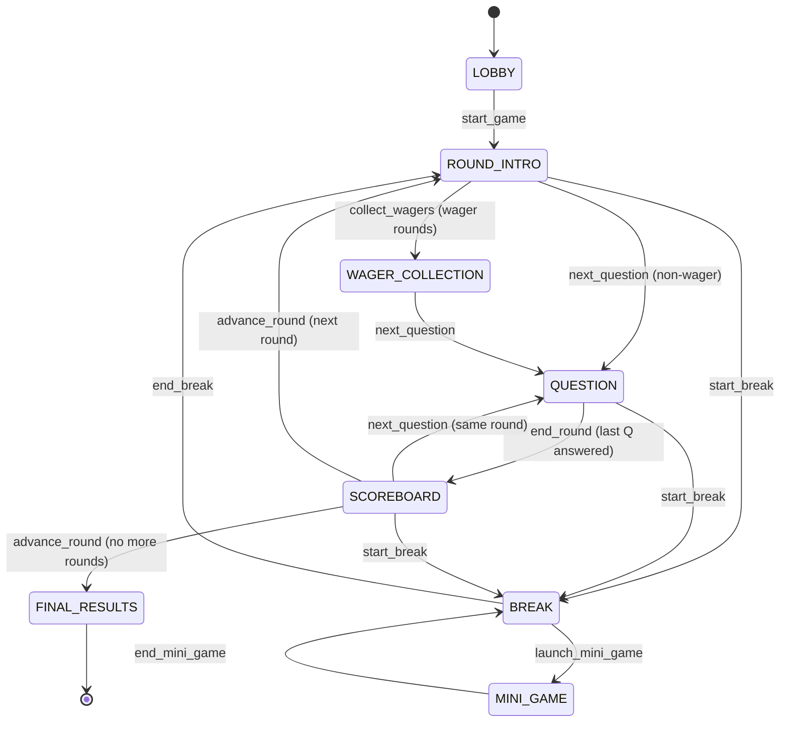
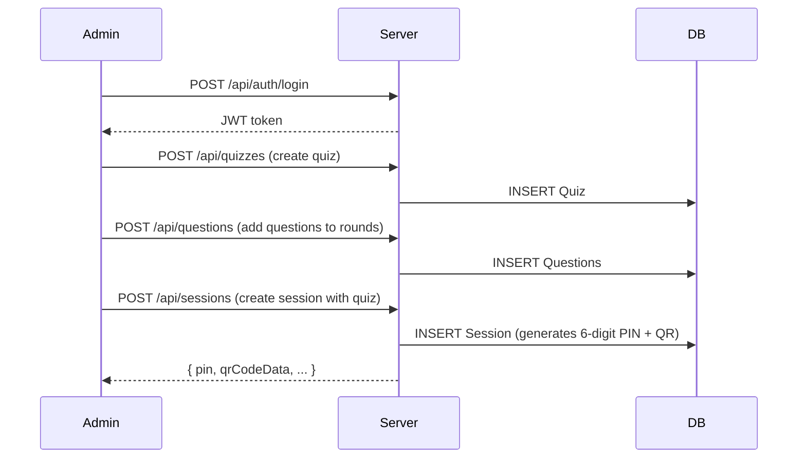
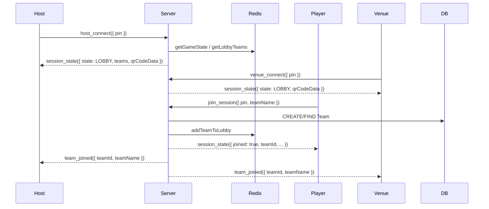
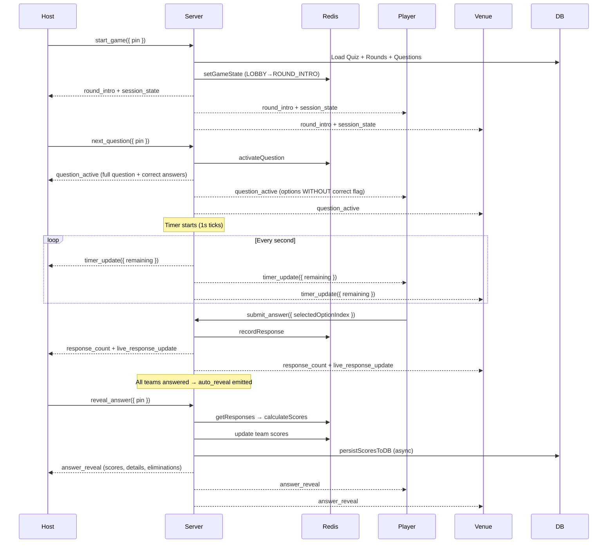
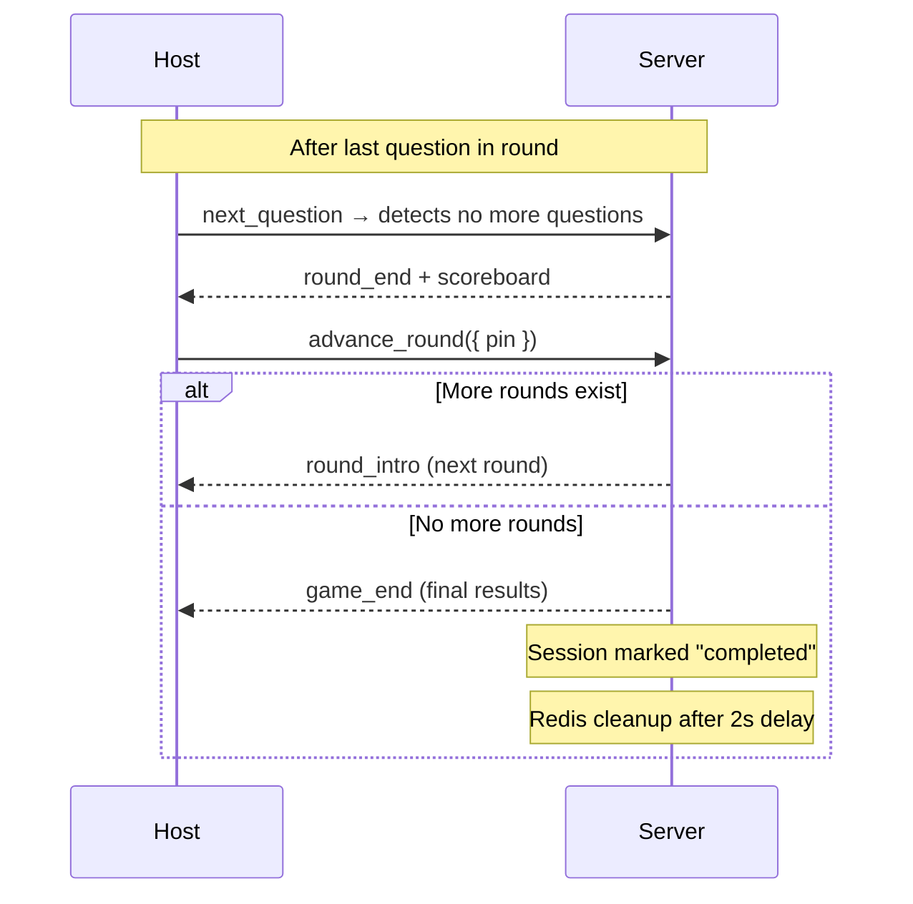
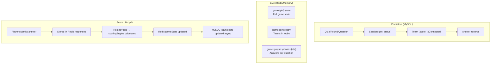

# Max Showdown Trivia — Game Flow, Sockets & Data Deep-Dive

## 1. System Overview

A real-time live trivia platform for venues (bars, events), supporting 300+ concurrent players. The system has **four interfaces** that all connect to a single Fastify server (`:5001`) via REST and/or WebSocket:



| Interface | Auth | Protocol | Purpose |
|-----------|------|----------|---------|
| **Admin Panel** | JWT (admin role) | REST | Create quizzes, questions, sessions, upload media |
| **Host Control** | JWT (host role) | REST + WebSocket | Control live game flow (start, next Q, reveal, etc.) |
| **Player Mobile** | None (PIN-based) | WebSocket | Join via 6-digit PIN, answer questions |
| **Venue Display** | None | WebSocket | Big-screen display (QR code, questions, scoreboard) |

---

## 2. Data Model & Relationships



**Two storage layers operate simultaneously:**

| Layer | What it stores | Why |
|-------|---------------|-----|
| **MySQL** (Sequelize) | Quizzes, rounds, questions, sessions, teams, answers | Persistent, survives restarts |
| **Redis** (or in-memory Map fallback) | Live game state, lobby teams, responses per question | Fast reads/writes during gameplay |

### Redis Key Patterns

| Key | Data |
|-----|------|
| `session:{pin}` | `{ sessionId }` — maps PIN to DB session |
| `game:{pin}:state` | Full game state object (rounds, scores, current question, timer, etc.) |
| `game:{pin}:lobby` | Hash of team objects in lobby |
| `game:{pin}:teams` | Hash of team data with live scores |
| `game:{pin}:responses:{questionId}` | Hash of `teamId → JSON(response)` per question |

All keys have a 24h TTL. Redis operations always have an in-memory `Map` fallback via [redisSessionStore.js](file:///d:/Apurv/Projects/showdown_trivia/server/src/services/redisSessionStore.js).

---

## 3. Game State Machine

The game engine at [stateMachine.js](file:///d:/Apurv/Projects/showdown_trivia/server/src/services/game-engine/stateMachine.js) enforces strict state transitions:



### Question Sub-States

Within the `QUESTION` state, each question goes through:

```
WAITING → ACTIVE → REVEALED
```

- **WAITING**: Question loaded, not yet shown to players
- **ACTIVE**: Timer running, accepting answers
- **REVEALED**: Correct answer shown, scores calculated

---

## 4. Complete Socket Event Catalog

All event names are defined in the shared [socketEvents.js](file:///d:/Apurv/Projects/showdown_trivia/shared/constants/socketEvents.js) — used by both client and server.

### 4.1 Player → Server Events

| Event | Payload | Handler | What Happens |
|-------|---------|---------|-------------|
| `join_session` | `{ pin, teamName }` | [playerHandlers.js:27](file:///d:/Apurv/Projects/showdown_trivia/server/src/socket/playerHandlers.js#L27) | Validates PIN, creates/reconnects team, joins socket room `session:{pin}`, emits full state back |
| `leave_session` | — | [playerHandlers.js:299](file:///d:/Apurv/Projects/showdown_trivia/server/src/socket/playerHandlers.js#L299) | Marks team disconnected, removes from live state, leaves socket room |
| `submit_answer` | `{ selectedOptionIndex, wagerAmount? }` | [playerHandlers.js:316](file:///d:/Apurv/Projects/showdown_trivia/server/src/socket/playerHandlers.js#L316) | Records answer in Redis, broadcasts response count and live stats |
| `submit_wager` | `{ amount }` | [playerHandlers.js:330](file:///d:/Apurv/Projects/showdown_trivia/server/src/socket/playerHandlers.js#L330) | Locks wager for current round (once per round, can't change) |
| `disconnect` | — (auto) | [playerHandlers.js:341](file:///d:/Apurv/Projects/showdown_trivia/server/src/socket/playerHandlers.js#L341) | Same as leave — cleans up team from live state |

### 4.2 Host → Server Events

| Event | Payload | Handler | What Happens |
|-------|---------|---------|-------------|
| `start_game` | `{ pin }` | [hostHandlers.js:32](file:///d:/Apurv/Projects/showdown_trivia/server/src/socket/hostHandlers.js#L32) | Loads quiz from DB, initializes game state, transitions LOBBY→ROUND_INTRO |
| `next_question` | `{ pin }` | [gameController.js:171](file:///d:/Apurv/Projects/showdown_trivia/server/src/services/game-engine/gameController.js#L171) | Advances question index, activates question, starts timer |
| `collect_wagers` | `{ pin }` | [gameController.js:1247](file:///d:/Apurv/Projects/showdown_trivia/server/src/services/game-engine/gameController.js#L1247) | Transitions to WAGER_COLLECTION state |
| `start_timer` | `{ pin }` | [gameController.js:1081](file:///d:/Apurv/Projects/showdown_trivia/server/src/services/game-engine/gameController.js#L1081) | Resumes a paused timer |
| `pause_timer` | `{ pin }` | [gameController.js:1072](file:///d:/Apurv/Projects/showdown_trivia/server/src/services/game-engine/gameController.js#L1072) | Pauses the countdown timer |
| `reveal_answer` | `{ pin }` | [gameController.js:415](file:///d:/Apurv/Projects/showdown_trivia/server/src/services/game-engine/gameController.js#L415) | Stops timer, calculates scores, handles eliminations, broadcasts results |
| `show_scoreboard` | `{ pin }` | [gameController.js:787](file:///d:/Apurv/Projects/showdown_trivia/server/src/services/game-engine/gameController.js#L787) | Shows scoreboard overlay without changing state |
| `hide_scoreboard` | `{ pin }` | [gameController.js:809](file:///d:/Apurv/Projects/showdown_trivia/server/src/services/game-engine/gameController.js#L809) | Hides scoreboard overlay |
| `advance_round` | `{ pin }` | [gameController.js:633](file:///d:/Apurv/Projects/showdown_trivia/server/src/services/game-engine/gameController.js#L633) | Moves to next round or FINAL_RESULTS if no more rounds |
| `start_break` | `{ pin }` | [gameController.js:822](file:///d:/Apurv/Projects/showdown_trivia/server/src/services/game-engine/gameController.js#L822) | Saves current state, transitions to BREAK |
| `end_break` | `{ pin }` | [gameController.js:872](file:///d:/Apurv/Projects/showdown_trivia/server/src/services/game-engine/gameController.js#L872) | Restores saved state, resumes game |
| `launch_mini_game` | `{ pin, game, config }` | [gameController.js:990](file:///d:/Apurv/Projects/showdown_trivia/server/src/services/game-engine/gameController.js#L990) | Activates Unity mini-game (e.g. card_shuffle) |
| `end_mini_game` | `{ pin, config }` | [gameController.js:1046](file:///d:/Apurv/Projects/showdown_trivia/server/src/services/game-engine/gameController.js#L1046) | Clears mini-game state |
| `add_team` | `{ pin, teamName, score? }` | [hostHandlers.js:196](file:///d:/Apurv/Projects/showdown_trivia/server/src/socket/hostHandlers.js#L196) | Manually adds a team during game |
| `remove_team` | `{ pin, teamId }` | [hostHandlers.js:271](file:///d:/Apurv/Projects/showdown_trivia/server/src/socket/hostHandlers.js#L271) | Purges team from DB + Redis + game state |
| `edit_team_score` | `{ pin, teamId, score }` | [hostHandlers.js:283](file:///d:/Apurv/Projects/showdown_trivia/server/src/socket/hostHandlers.js#L283) | Manually adjusts team score |
| `end_game` | `{ pin }` | [gameController.js:1135](file:///d:/Apurv/Projects/showdown_trivia/server/src/services/game-engine/gameController.js#L1135) | Force-ends game, persists scores, cleans up |
| `music_control` | `{ pin, action, mediaUrl? }` | [hostHandlers.js:183](file:///d:/Apurv/Projects/showdown_trivia/server/src/socket/hostHandlers.js#L183) | Pass-through to all clients for music playback |

### 4.3 Server → Client Events (Broadcasts)

| Event | When Emitted | Payload Summary |
|-------|-------------|-----------------|
| `session_state` | Join, state changes, reconnect | Full/partial game state snapshot |
| `round_intro` | New round begins | Round name, type, index |
| `wager_collection_start` | Wager round begins | Round info for wager input |
| `question_active` | Question shown to players | Question text, options (no correct flag), timer |
| `timer_update` | Every second during countdown | `{ remaining }` |
| `timer_expired` | Timer hits zero | `{}` |
| `response_count` | After each answer | `{ count, total }` |
| `live_response_update` | After each answer | `{ correct, incorrect, noAnswer, total }` |
| `auto_reveal` | All teams answered | `{}` — signals host to reveal |
| `answer_reveal` | Host reveals answer | Correct index, per-team scores, response details, eliminations |
| `scoreboard` | Round end or manual toggle | Sorted teams array |
| `round_end` | Last question in round revealed | `{ roundIndex }` |
| `team_joined` | Team joins lobby | Team data |
| `team_removed` | Team leaves/kicked | `{ teamId }` |
| `team_updated` | Score edited | Team data |
| `player_eliminated` | Elimination round | `{ teamId }` |
| `break_start` / `break_end` | Break toggled | Duration |
| `mini_game_start` / `mini_game_end` | Mini-game lifecycle | Game type + config |
| `game_end` | Final round done or force-end | Sorted teams array |
| `session_deleted` | Admin deletes session | — |

### 4.4 Reconnection Events

| Event | Actor | Handler |
|-------|-------|---------|
| `venue_connect` | Venue display | [venueHandlers.js:15](file:///d:/Apurv/Projects/showdown_trivia/server/src/socket/venueHandlers.js#L15) |
| `host_connect` | Host dashboard | [venueHandlers.js:83](file:///d:/Apurv/Projects/showdown_trivia/server/src/socket/venueHandlers.js#L83) |
| `join_session` (with existing team name) | Player | [playerHandlers.js:27](file:///d:/Apurv/Projects/showdown_trivia/server/src/socket/playerHandlers.js#L27) |

All three rebuild the full state payload and replay the appropriate events (e.g., if reconnecting during `QUESTION` state, the question + timer position are re-sent).

---

## 5. Full Game Lifecycle — Step by Step

### Phase 1: Setup (REST, Admin Panel)



### Phase 2: Lobby (WebSocket)



### Phase 3: Active Game (WebSocket)



### Phase 4: Round Transitions



---

## 6. Scoring Engine

The [scoringEngine.js](file:///d:/Apurv/Projects/showdown_trivia/server/src/services/game-engine/scoringEngine.js) delegates to per-round-type handlers:

| Round Type | Handler | Scoring Logic |
|------------|---------|--------------|
| `MULTIPLE_CHOICE` | [multipleChoice.js](file:///d:/Apurv/Projects/showdown_trivia/server/src/services/game-engine/roundHandlers/multipleChoice.js) | +2 correct, -1 wrong |
| `WAGER` | [wager.js](file:///d:/Apurv/Projects/showdown_trivia/server/src/services/game-engine/roundHandlers/wager.js) | ±wagered amount (locked pre-question) |
| `MUSIC` | [music.js](file:///d:/Apurv/Projects/showdown_trivia/server/src/services/game-engine/roundHandlers/music.js) | +2 correct, -1 wrong (timer starts paused for music playback) |
| `ELIMINATION` | [elimination.js](file:///d:/Apurv/Projects/showdown_trivia/server/src/services/game-engine/roundHandlers/elimination.js) | +2 correct, eliminated if wrong (unless ALL wrong → no one eliminated) |
| `MAJORITY_RULES` | [majorityRules.js](file:///d:/Apurv/Projects/showdown_trivia/server/src/services/game-engine/roundHandlers/majorityRules.js) | Points = number of teams who chose the same option |
| `FINAL_MULTIPLE_CHOICE` | [finalMultipleChoice.js](file:///d:/Apurv/Projects/showdown_trivia/server/src/services/game-engine/roundHandlers/finalMultipleChoice.js) | +3 correct, -1 wrong |
| `FINAL_WAGER` | [finalWager.js](file:///d:/Apurv/Projects/showdown_trivia/server/src/services/game-engine/roundHandlers/finalWager.js) | ±wagered percentage of current score |

### Wager Flow (Special)

Wager rounds have an extra phase:

```
ROUND_INTRO → WAGER_COLLECTION → QUESTION → ...
```

1. Host clicks "Next" on a wager round → `collect_wagers` auto-fires
2. Server transitions to `WAGER_COLLECTION` state, emits `wager_collection_start`
3. Players see a wager input slider and submit via `submit_wager`
4. Wager is **locked once per round** — can't change
5. Host clicks "Next" again → transitions to `QUESTION`
6. On reveal, the locked wager amount is used for scoring (±wager)

### Elimination Flow (Special)

- Teams answering **wrong are eliminated** (`isEliminated: true`) and removed from `activeTeamIds`
- **Exception**: if **ALL teams answer wrong**, nobody is eliminated (the "all-wrong rule")
- Elimination state resets between rounds — teams come back for the next round
- The [knockoutEngine.js](file:///d:/Apurv/Projects/showdown_trivia/server/src/services/game-engine/knockoutEngine.js) tracks elimination state per-PIN in memory

---

## 7. Client-Side Socket Architecture

### Socket Singleton ([socket.ts](file:///d:/Apurv/Projects/showdown_trivia/client/lib/socket.ts))

- Single `Socket.io` instance shared across all pages via `getSocket()`
- Uses WebSocket transport with polling fallback
- Auto-reconnects (10 attempts, 1-5s delay)
- Connection state recovery enabled (120s window)
- All outgoing/incoming events are logged via `clientLogger`

### useSocket Hook ([useSocket.ts](file:///d:/Apurv/Projects/showdown_trivia/client/hooks/useSocket.ts))

- Returns `{ socket, isConnected }`
- Socket is **NOT disconnected on unmount** — it persists across page navigations
- Only local event listeners are cleaned up on unmount

### Connection Flow per Client Type

```mermaid
graph TD
    subgraph "Player Mobile"
        P1["Enter PIN + Team Name"] --> P2["emit join_session"]
        P2 --> P3["Receive session_state"]
        P3 --> P4["socket.join room"]
    end
    
    subgraph "Host Dashboard"
        H1["Login via REST"] --> H2["emit host_connect({pin})"]
        H2 --> H3["Receive full state"]
    end
    
    subgraph "Venue Display"
        V1["Open /venue/display?pin=..."] --> V2["emit venue_connect({pin})"]
        V2 --> V3["Receive full state + QR"]
    end
```



---

## 8. Socket Middleware & Security

### Socket Guard ([socketGuard.js](file:///d:/Apurv/Projects/showdown_trivia/server/src/middleware/socketGuard.js))

Wraps every incoming socket event:
- Validates that `pin` (if present) is exactly 6 digits
- Rejects malformed PINs with an error emit
- Does **NOT** authenticate — players join purely by PIN

### Socket Room Pattern

All clients in a session join the room `session:{pin}`. Every broadcast uses:
```js
io.to(`session:${pin}`).emit(EVENT, payload);
```

This ensures events are scoped to the correct game session.

---

## 9. Key Data Flow Summary



> [!IMPORTANT]
> **Scores live in Redis during gameplay** and are periodically persisted to MySQL asynchronously (`persistScoresToDB`). The MySQL write happens on every `revealAnswer` call and also on `endGame` / natural game completion. This means a server crash mid-game could lose the most recent question's scores.

> [!NOTE]  
> **Timer management** is handled server-side by [timerManager.js](file:///d:/Apurv/Projects/showdown_trivia/server/src/services/game-engine/timerManager.js) using `setInterval` with 1s ticks. The timer state (remaining seconds) is stored in the game state and synced to clients. When all active teams have answered, `forceExpire` stops the timer early and emits `auto_reveal`.

---

## 10. Mini-Game Integration

Mini-games (e.g., `card_shuffle`) are **Unity WebGL builds** embedded via `react-unity-webgl`:

1. Host clicks "Launch Mini-Game" → `launch_mini_game` event
2. Server sets `activeMiniGame` in game state and creates mini-game specific state
3. All clients receive `mini_game_start` and render the Unity iframe
4. Unity ↔ React communication happens via [miniGameHandlers.js](file:///d:/Apurv/Projects/showdown_trivia/server/src/socket/miniGameHandlers.js)
5. Server tracks picks, reveals correct position, broadcasts results per player
6. Host ends mini-game → `end_mini_game` → state cleared, `mini_game_end` broadcast

---

## 11. Session Cleanup

When a game ends (naturally or force-ended):

1. Session status updated to `completed` in MySQL
2. After a 2-second delay:
   - All Redis keys for `game:{pin}:*` and `session:{pin}` are deleted
   - All sockets are removed from the `session:{pin}` room
3. `game_end` event sent with final sorted team standings
